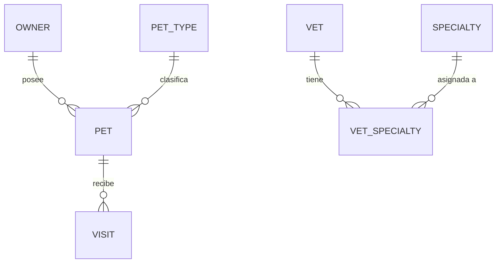

# Modelo de entidades

## Diagrama entidad-relación

### OWNER

Representa a un dueño de mascotas registrado en la clínica que puede traer mascotas a consultas.

| Atributo   | Descripción                              | Tipo de dato | Longitud/Precisión | Reglas de validación          |
|------------|------------------------------------------|--------------|--------------------|-------------------------------|
| id         | Identificador único                      | Integer      | 10                 | Clave primaria, secuencia     |
| first_name | Nombre del dueño                         | String       | 30                 | No nulo                       |
| last_name  | Apellido del dueño                       | String       | 30                 | No nulo                       |
| address    | Dirección postal del dueño               | String       | 255                | No nulo                       |
| city       | Ciudad de residencia                     | String       | 80                 | No nulo                       |
| telephone  | Teléfono de contacto (10 dígitos)        | String       | 20                 | No nulo, formato: \d{10}      |

### PET

Representa un animal perteneciente a un dueño que puede ser objeto de consultas veterinarias.

| Atributo   | Descripción                                    | Tipo de dato | Longitud/Precisión | Reglas de validación                 |
|------------|------------------------------------------------|--------------|--------------------|--------------------------------------|
| id         | Identificador único                            | Integer      | 10                 | Clave primaria, secuencia            |
| name       | Nombre de la mascota                           | String       | 30                 | No nulo                              |
| birth_date | Fecha de nacimiento de la mascota              | Date         | -                  | Opcional                             |
| type_id    | Referencia al tipo de mascota (especie)         | Integer      | 10                 | No nulo, clave foránea (TYPES.id)    |
| owner_id   | Referencia al dueño propietario                | Integer      | 10                 | No nulo, clave foránea (OWNERS.id)   |

**Restricciones:** El nombre de una mascota debe ser único dentro del ámbito de su dueño. La fecha de nacimiento no puede ser futura.

### PET_TYPE

Define la especie o categoría de una mascota (p. ej., gato, perro, hámster, lagarto, serpiente, ave).

| Atributo | Descripción                        | Tipo de dato | Longitud/Precisión | Reglas de validación       |
|----------|------------------------------------|--------------|--------------------|----------------------------|
| id       | Identificador único                | Integer      | 10                 | Clave primaria, secuencia  |
| name     | Nombre visible del tipo de mascota | String       | 80                 | No nulo, único             |

### VISIT

Representa una consulta veterinaria reservada para una mascota concreta, documentando el motivo de la cita.

| Atributo    | Descripción                              | Tipo de dato | Longitud/Precisión | Reglas de validación                |
|-------------|------------------------------------------|--------------|--------------------|-------------------------------------|
| id          | Identificador único                      | Integer      | 10                 | Clave primaria, secuencia           |
| visit_date  | Fecha de la consulta (por defecto, hoy)  | Date         | -                  | No nulo                             |
| description | Descripción del motivo de la consulta    | String       | 255                | No nulo                             |
| pet_id      | Referencia a la mascota consultada       | Integer      | 10                 | No nulo, clave foránea (PETS.id)    |

### VET

Representa a un veterinario empleado por la clínica que puede tener una o más especialidades.

| Atributo   | Descripción           | Tipo de dato | Longitud/Precisión | Reglas de validación      |
|------------|-----------------------|--------------|--------------------|---------------------------|
| id         | Identificador único   | Integer      | 10                 | Clave primaria, secuencia |
| first_name | Nombre del veterinario| String       | 30                 | No nulo                   |
| last_name  | Apellido del veterinario | String    | 30                 | No nulo                   |

### SPECIALTY

Define una especialidad veterinaria (p. ej., radiología, cirugía, odontología) que puede asignarse a veterinarios.

| Atributo | Descripción                      | Tipo de dato | Longitud/Precisión | Reglas de validación      |
|----------|----------------------------------|--------------|--------------------|---------------------------|
| id       | Identificador único              | Integer      | 10                 | Clave primaria, secuencia |
| name     | Nombre visible de la especialidad| String       | 80                 | No nulo, único            |

### VET_SPECIALTY

Entidad de unión que asocia veterinarios con las especialidades que poseen (muchos a muchos).

| Atributo     | Descripción                          | Tipo de dato | Longitud/Precisión | Reglas de validación                       |
|--------------|--------------------------------------|--------------|--------------------|--------------------------------------------|
| vet_id       | Referencia al veterinario            | Integer      | 10                 | No nulo, clave foránea (VETS.id)           |
| specialty_id | Referencia a la especialidad asignada| Integer      | 10                 | No nulo, clave foránea (SPECIALTIES.id)     |

**Restricciones:** La combinación de vet_id y specialty_id es única (clave primaria compuesta).
